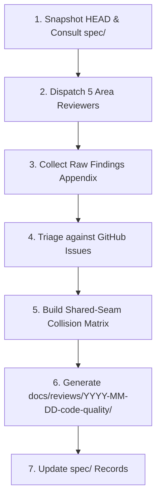

# Code-Quality & Architecture Review Skill

The **Code-Quality Audit Skill** standardizes the execution of milestone architecture passes, code audits, and quality reviews across `Shangmin-Chen/cube`.

It formalizes the five-area audit methodology established in **PR #67** (`docs: 2026-09-13 code-quality review`), enabling Gemini and Antigravity agents to systematically audit current HEAD, triage findings against GitHub Issues, generate shared-seam collision matrices, and publish structured documentation dossiers.

---

## Operating Principles

1. **Audit Current Reality (Product HEAD):**
   - Audit the code as it actually exists at product HEAD.
   - Do not treat unmerged `fix/*` branches or local WIP in other worktrees as shipped evidence.
   - Measure codebase drift against canonical specifications in [`spec/`](../../../spec/README.md).
2. **Worktree & Branch Isolation:**
   - Always run the review on a dedicated branch or worktree (e.g. `docs/code-quality-review` or `.worktrees/code-quality-YYYY-MM-DD`).
   - The review is **documentation-only**: zero modifications to `src/` or `scripts/`.
3. **No Phantom Findings:**
   - Every finding must cite exact file paths and line ranges (`file:line`).
   - Provide concrete reproduction steps, edge cases, or failure scenarios.
4. **Prudent Issue Grouping (No Ticket Floods):**
   - Do not open 50+ micro-tickets for minor nits.
   - Group cohesive findings into 10–15 independently actionable issues.
   - When a finding provides new evidence for an existing issue, comment on the existing issue via `gh issue comment` rather than filing a duplicate.
5. **Shared-Seam Collision Mapping:**
   - Analyze which files are affected across multiple prospective bug fixes.
   - Generate `collision-map.md` so subsequent parallel development branches do not collide.

---

## The 5 Audit Areas & Identifier Taxonomies

To ensure exhaustive coverage without context saturation, partition the audit across five distinct domains:

| Area | Prefix | Core Focus & Typical Failure Modes |
|---|---|---|
| **1. Trainer** | `T-01` … `T-14` | Flashcard state machine, round mastery isolation, keyboard auto-repeat leaks, bookmark deck resets, scramble setup logic, active recall grading fairness. |
| **2. UI / Timer / Shell** | `U-01` … `U-14` | Spacebar vs touch double-fire, inspection countdown penalties (+2/DNF), in-progress solve drop on route navigation, 3D Twisty preview modes, unused shell components, layout shift, a11y. |
| **3. Data / Math / Types** | `D-01` … `D-14` | KPuzzle algorithm validity, 2-look hold orientations, corner/edge probability distributions, canonical vs alternative parity, TypeScript typing of generated datasets, AUF notation. |
| **4. Pipeline / Scripts** | `P-01` … `P-14` | Upstream ingestion security (`vm.runInContext`), lockfile SHA-256 integrity, AST/regex transformation fail-open vs fail-closed rules, verification script completeness, CI execution parity. |
| **5. Cross-Cutting Habits** | `X-01` … `X-15` | Dead Vite/shadcn kit, copy-paste duplication, god modules, untracked `localStorage` keys, AI comment slop, missing tests, and shared-seam file collisions (`X-13`). |

---

## Execution Protocol



### Phase 1: Environment Snapshot & Spec Review

1. Create and switch to an isolated review branch:
   ```bash
   git checkout -b docs/code-quality-review
   ```
2. Note the target commit SHA (`git rev-parse --short HEAD`) and current date.
3. Review canonical constraints in [`spec/`](../../../spec/README.md) before auditing code to ensure you evaluate implementation against documented domain rules:
   - [`spec/architecture.md`](../../../spec/architecture.md) (module hierarchy, state flow)
   - [`spec/algorithms-and-methods.md`](../../../spec/algorithms-and-methods.md) (stiff invariants, method tiers)
   - [`spec/quality-and-issues.md`](../../../spec/quality-and-issues.md) (test posture, open trackers)

### Phase 2: Multi-Subagent Audit Dispatch

Invoke specialized subagents concurrently using `invoke_subagent` (or conduct structured sequential passes) for each domain:

#### Reviewer Subagent Prompt Template
```text
Role: Code-Quality Auditor — Area: [Area Name: e.g. UI / Timer / Shell]
Target Commit: [Commit SHA]
ID Prefix: [T | U | D | P | X]

Directives:
1. Read-only inspection of source code, scripts, and specs.
2. Inspect [target file list or domain modules].
3. For each defect discovered, record:
   - ID: [Prefix]-XX (e.g. U-04)
   - Title: Crisp summary
   - Kind: Invariant Violation | Runtime Bug | Architecture Debt | AI Slop
   - Severity: Critical | High | Medium | Nit
   - Location: File path and line numbers (path:Lxx-Lyy)
   - Evidence & Rationale: Concrete reproduction or technical explanation
   - Proposed Fix: Actionable direction
   - Existing Issue Pointer: If related to an existing tracker (#xx)
4. Do not speculate; every claim must have a direct code citation.
```

### Phase 3: Raw Findings Ingestion

Consolidate the reviewer outputs into `_handoff/pass-raw-findings.md`.

Format each entry systematically:
```markdown
### [ID] [Title]
- **Severity:** Critical | High | Medium | Nit
- **Kind:** Bug | Invariant | Architecture | Habit | Slop
- **Location:** `src/path/to/file.ts:L45-L52`
- **Existing Issue:** #xx (or None)
- **Description:** <Technical details, reproduction case, and root cause>
- **Proposed Remediation:** <Actionable fix recommendations>
```

### Phase 4: GitHub Issue Triage & Deduplication

1. Fetch all existing open and closed issues:
   ```bash
   gh issue list --state all --limit 100
   ```
2. Triage findings:
   - **True Duplicates / Already Fixed:** Mark resolved; do not refile.
   - **Extra Evidence on Open Issues:** Do not file twin issues. Add targeted comments with line citations:
     ```bash
     gh issue comment <ISSUE_ID> --body "Extra evidence from architecture review at \`COMMIT_SHA\` (Finding [ID]): \`file/path:Lxx-Lyy\`..."
     ```
   - **New Defects:** Group cohesive findings by subsystem into 10–15 independently actionable issues:
     ```bash
     gh issue create --title "<Component>: <Clear description>" \
       --label "bug" \
       --body "$(cat <<'EOF'
     ## Summary
     <Description of the defect>

     ## Evidence
     - `file/path.ts:Lxx-Lyy` (Finding ID)

     ## Proposed Remediation
     <Clear acceptance criteria>
     EOF
     )"
     ```

### Phase 5: Collision Matrix Generation (`collision-map.md`)

Cross-reference all touched files across open and newly filed issues. Construct a matrix identifying **shared seams**:

```markdown
# Collision Map: Shared Seams

| File | Associated Issues | Risk Level | Mitigation Strategy |
|---|---|---|---|
| `src/hooks/useTrainerSession.ts` | #54, #55, #56 | High | Order PRs sequentially; merge state isolation before UI handlers. |
| `src/components/TimerTab.tsx` | #58, #59, #60 | High | Isolate pointer/touch fix from 3D scramble preview refactor. |
```

### Phase 6: Standardized Documentation Dossier

Write the complete audit dossier into `docs/reviews/YYYY-MM-DD-code-quality/`:

```
docs/reviews/YYYY-MM-DD-code-quality/
├── README.md               # Executive summary, metadata table, area summary
├── process.md              # Methodology, worktree constraints, evidence rules
├── architecture-habits.md  # Systemic architectural patterns, habits, and debt
├── findings-by-group.md    # Findings grouped by issue with file citations
├── issue-map.md            # Traceability matrix: Finding ID -> GitHub Issue URL
└── collision-map.md        # Shared-seam collision analysis for parallel development
```

### Phase 7: Verification & Final Spec Sync

1. Confirm repository integrity:
   - Ensure zero diff in `src/` and `scripts/`:
     ```bash
     git status --porcelain src/ scripts/
     ```
   - Verify all test and verification suites pass cleanly:
     ```bash
     npm run lint
     npm run verify:algs
     npm run verify:triggers
     npm run verify:trainer
     npm run verify:upstream-pin
     npm run build
     ```
2. Update [`spec/quality-and-issues.md`](../../../spec/quality-and-issues.md) with references to newly filed issues and the audit dossier.

---

## Summary of Deliverables

An audit pass executed under this skill is complete when:
- [ ] Dossier is populated in `docs/reviews/YYYY-MM-DD-code-quality/`.
- [ ] Raw findings are documented in `_handoff/pass-raw-findings.md`.
- [ ] No twin issues were filed for already-tracked bugs.
- [ ] Extra evidence comments were added to existing trackers.
- [ ] New issues are grouped, labeled, and independently actionable.
- [ ] Collision map clearly flags all shared files.
- [ ] 0 lines of code were modified in `src/` or `scripts/`.
- [ ] All verification scripts run and exit with code 0.
