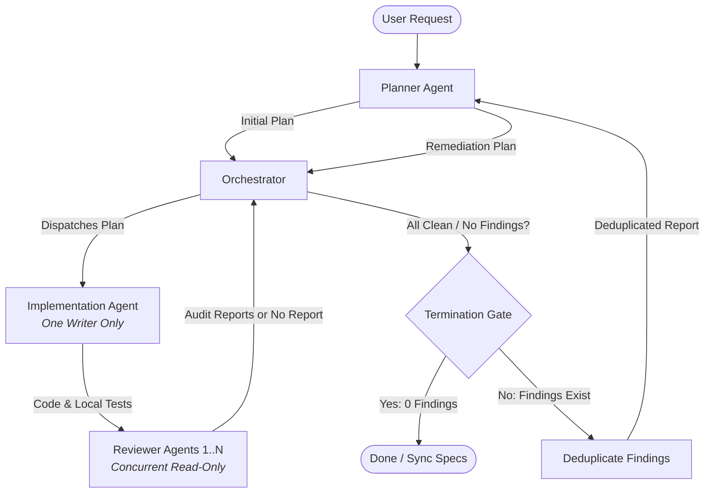

# Review Loop Orchestration Skill

The **Review Loop** coordinates multi-agent development to build features, refactor code, and fix bugs without regressions or AI slop.

The **Orchestrator Agent** (main session) is strictly a coordinator and deduplicator. It does not write code or draft plans directly.

---

## Core Architecture



### Roles

1. **Orchestrator Agent (Main Session):**
   - Coordinates handoffs and tracks iteration counts (max 5 iterations).
   - Collects reviewer responses, unifies overlapping issues, and deduplicates findings.
   - Terminates when **all review agents return no report** (or clean 0 findings).
2. **Planner Agent (`planner-agent`):**
   - Mode 1 (Initial): References `spec/` to draft the initial task specification.
   - Mode 2 (Remediation): Converts the orchestrator's deduplicated findings into targeted fix instructions.
3. **Implementation Agent (`implementation-agent`):**
   - **One Writer Only:** Exactly one agent edits code per loop iteration.
   - Pure execution: writes code directly based on the plan and runs local tests.
4. **Reviewer Agents (`reviewer-agent`):**
   - Concurrent read-only auditors (e.g. 3 reviewers running simultaneously).
   - Enforce stiff invariants, hunt runtime bugs, and smell for AI slop.
   - Returns an audit report *only* when findings exist. Returns **no report** when clean.

---

## Execution Protocol

### Step 1: Initial Plan
- Orchestrator invokes `planner-agent` with the user request.
- Planner reviews `spec/` and outputs a plan specifying objectives, invariants, file targets, and verification commands.

### Step 2: Implementation (One Writer)
- Orchestrator routes the plan to a single `implementation-agent`.
- Implementer modifies code, runs local verifications (`npm run lint`, `verify:*`, `build`), and reports modified files.

### Step 3: Concurrent Multi-Review
- Orchestrator spawns $N$ `reviewer-agent` instances concurrently (e.g. 3 reviewers).
- Each reviewer inspects the diff independently:
  - **Findings exist:** Reviewer returns an audit report with file paths, line numbers, and severities.
  - **No findings:** Reviewer returns **no report** (or `NO REPORT / ZERO FINDINGS`).

### Step 4: Deduplication & Convergence Gate
- Orchestrator evaluates all reviewer outputs:
  - **All Clean:** If all reviewers return no report (or 0 findings), the loop terminates. Proceed to Step 6.
  - **Findings Exist:** The Orchestrator compares reports, merges duplicates across identical files/lines, and produces a single deduplicated findings list.
- If findings remain, proceed to Step 5.

### Step 5: Remediation Planning
- Orchestrator sends deduplicated findings to `planner-agent`.
- Planner emits a surgical remediation plan.
- Orchestrator sends remediation plan to `implementation-agent` (loops to Step 2).

### Step 6: Final Verification & Spec Sync
- Orchestrator runs full repository verification:
  ```bash
  npm run lint
  npm run verify:algs
  npm run verify:triggers
  npm run verify:trainer
  npm run verify:upstream-pin
  npm run build
  ```
- Updates canonical living specs (`spec/current-state.md`, `spec/architecture.md`) if public contracts or datasets changed.
